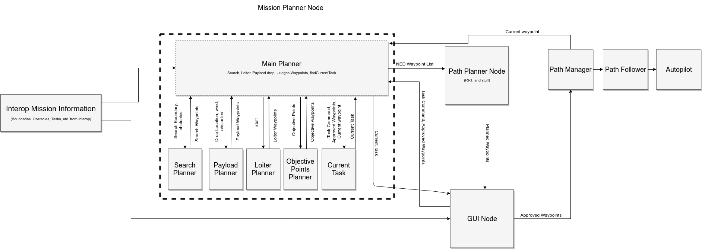

# Capstone Team 45 Status Update 03-13-2019

The following is a list of status updates and goals for each of the four subteams:

* * *

## Airframe

(*Ryan Anderson, Tyler Critchfield, Kameron Eves*)

**Last Week:**

- Worked on second airframe (very close to being finished, receiving some final parts)
- Assisted in the new mission planner software design
- We lost a battery...we think it might have been because we left it plugged in for too long, starting from too low a voltage during hardware testing

**Next Week:**

- Finish the second airframe
- Assist in software development

## Controls

(*Andrew Torgesen, Brady Moon, John Akagi*)

**Last Week:**

- Completed the overhauled estimator and tested/validated it on flight test data
- Created a software scheme for all mission objectives that makes things modular and changes how tasks are commanded, with the following advantages:
    - we can use the old system for completing our key success measures while streamlining the cleaned-up system for the competition in June
    - development is made easier for us now, as well as next year's team
    - it allows for dynamic reconfiguration of waypoints in the air, which is necessary for things like accounting for wind in the payload drop

\ 

**Next Week:**

- have preliminary "vanilla" static obstacle path planner working (we can leverage last year's code here)
- fly waypoints in hardware and get ready for mock competition

## UGV

(*Jacob Willis, Derek Knowles, Brandon McBride*)

**Last Week:**

- Started developing payload planner for mission software suite.
- Fixed problem with arduino on airframe
- Added LED to arduino to time signal to release
- Not much else. We've been helping with other things this week.

**Next Week:**

- Assemble the UGV with all the new electronics
- Work on wiring for the second airframe
- Work on the path planner for the payload drop

## Vision

(*Tyler Miller, Jake Johnson, Connor Olsen*)

**Last Week:**

- figured out why we couldnt stream images - ros network issue
- geolocation, unit test progress
- shape classifier does well against detected targets - 3/5 correctly classified (improvement from v1's 0/5). have an idea on how to augment dataset for better accuracy

**Next Week:**

- geolocation unit tests
- verify we have fixed the network issue, document solution, test fly live manual classification

* * *

Please send us any feedback with regards to the progress we've made, as well as our plans for the coming week.
